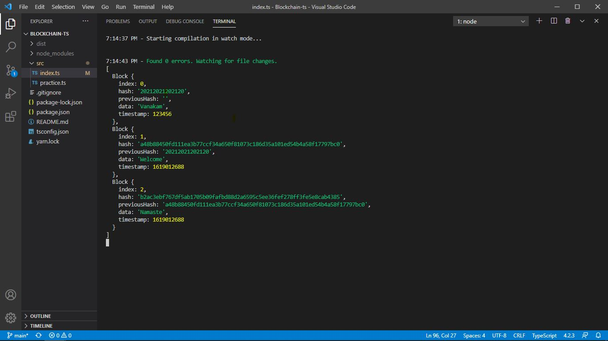

# Typechain

Building Blockchain with TypeScript

TypeScript is a superset of JavaScript

## Blockchain example

## Commands used for this project

1. npm install --global yarn
2. yarn init
3. yarn global add typescript
4. npm install typescript --save-dev
5. npx tsc
(For compilation of typescript to javascript)
6. yarn start
7. yarn add tsc-watch --dev